# Crypto Asset Tracker - Sports Edition
Crypto Asset Tracker - Sports Edition (or CATsport for short) is an ASP.NET Web Application (.NET Framework) in the C# programming language. CATsport is an application that aims to provide an easy way for sports enthusiasts to visualize and manage sports-related, non-fungible token (NFT) assets across multiple platforms. Without question, the visibility, popularity, and accessibility of sports NFTs has been on the rise. While Version 1 of the application focuses on a single type of sports NFT (NBA's TopShot), I wanted to lay the foundation for a potentially beneficial tool for cross-platform collectors. Future versions will hopefully expand functionality and have greater utility as well as accessibility.

## Version

Version 1 (V1) was published to Azure on 5/9/2021 and can be found here: https://catsport.azurewebsites.net/Home

Version 2 is in development.

This ReadMe file was created for the release of V1 and has not yet been updated to correspond with any, more current versions.

## Description

This app enables the creation, management, and deletion of: Players, Assets, Collections, and Sold Assets.

More specifically, a User can view, create, update, and delete an Asset that includes the following information:

- Player
- Category
- Date
- Set
- Series
- Serial/Edition Size
- Tier
- Mint
- Pack Amount
- Pack Price
- Individual Price

As mentioned above, Assets can have a specific Player assigned. A User can also view, create, update, and delete a Player that includes the following information:

- First Name
- Last Name
- Position
- Team

An Asset can be re-designated as a Sold Asset, which, in turn, captures the original information of the Asset and adds:

- Sold Price

Finally, Assets can be added to Collections which a user can view, create, update, and delete and includes:

- Name
- Description

## Installations

There are no installation requirements at this time.

## Requirements

This app was optimized for running with the Google Chrome web browser. The user experience may be impacted if viewing in a different web browser.

## Usage

### Register User & Login

When navigating to CATsport for the first time, links to login and register a new user are located in the top right hand corner of the Home page (**figure 1**).

**figure 1**

Username and password requirements are set to the ASP.NET defaults. Passwords need to be at least six characters long and must contain an uppercase character, lowercase character, a digit, and a non-alphanumeric character. V1 has a one-step registration process & does not allow for the validation of email addresses or the resetting of passwords. To register, simply fill in the required form fields and hit the "Sign Up" button (**figure 2**).

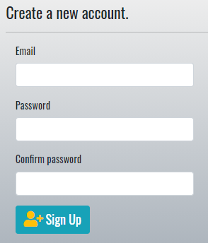
**figure 2**

Once registered, log in by filling in the required form fields and hit the "Log In" button (**figure 3**).

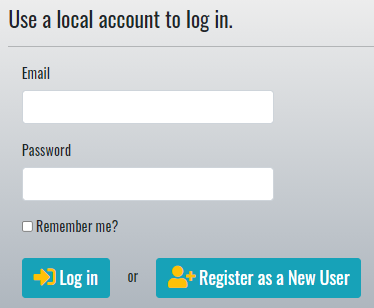
**figure 3**

### Navigation

Once logged in, select the toggle button shown in **figure 1** to view navigation options (**figure 4**). Navigation options are hidden each time a new page is navigated to.

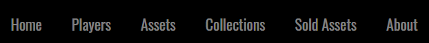
**figure 4**

Most pages have intuitive navigation and buttons to help with direction. For example, "Back to" buttons are located towards the bottom of most views and will bring the user back to a main page (**figure 5**).

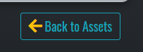
**figure 5**

### Search

Search bars are specific to whichever page they are on. For example, the search bar located on the Players page will only search for players. Searching for an Asset will require navigating to the Assets page and using its search bar.

### Page

Once a specific row limit is reached, tables will automatically "paginate", that is, create numbered pages that can be navigated. On some tables, an option is available to set how many rows will be displayed.

### Creating a Player, Asset, or Collection

The creation of Players, Assets, and Collections follow a similar pattern. On the main view for those pages, a "New" button is located in the bottom right-hand corner (**figure 6**). Simply hit this button to bring up a form to complete. Once the required form fields are filled, submit the form by hitting the "Add" button towards the end of the form (**figure 7**). If successful, a validation message will appear and re-direction back to the associated main view will occur. The newly added Player, Asset, or Collection can now be visualized.   

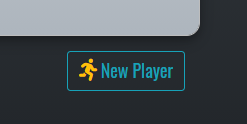
**figure 6**

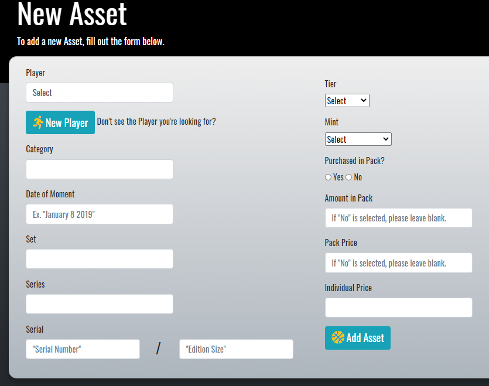
**figure 7**

### Record Asset Sale (create a Sold Asset)

To record an Asset sale (or "create" a Sold Asset), select the "Inspect" button for the desired Asset(**figure 8**). Towards the bottom of the detail page under "Asset Management", select "Record a Sale". The form on the next page only requires a Sale Price for submission. If successfully recorded, the Sold Asset will become avaible for viewing. Recording a sale of an Asset will prompt the removal of that Asset which can be reviewed further down.

### Details on a specific Player, Asset, Collection, or Sold Asset

Hitting the "Inspect" button will display details about a specific Player, Asset, or Sold Asset (**figure 8**), although inspecting a Player is not fully functioning at this time. To see the contents of a Collection, hover over desired Collection and click on it (**figure 9**).

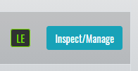
**figure 8**

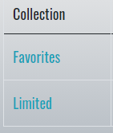
**figure 9**

### Managing a specific Player, Asset, Collection, or Sold Asset

Management tools are generally located towards the bottom of detail views (**figure 10**). Players, Assets, Collections, and Sold Assets can all be modified or removed. Additionally, Collections can have Assets added or removed without modifying the Collection itself, and Assets can be recorded as sold (see **"Record Asset Sale"** above).

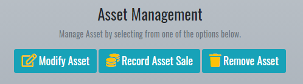
**figure 10**

### Modifying a Player, Asset, Collection, or Sold Asset

To modify a Player, Asset, Collection, or Sold Asset, look for the "Modify" button among the management buttons (**figure 11**). Modify forms will be populated with any previously stored data and modifications are submitted/validated similarly to when creating.

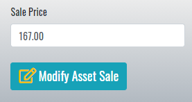
**figure 11**

### Removing a Player, Asset, Collection, or Sold Asset

Selecting a "Remove" button will cause re-direction to a page to verify the desired action. Removing a Player, Asset, Collection, or Sold Asset is irreversible unless specified otherwise. "Remove" buttons are red and will detail the repercussions of removing the Player, Asset, Collection, or Sold Asset (**figure 12**).

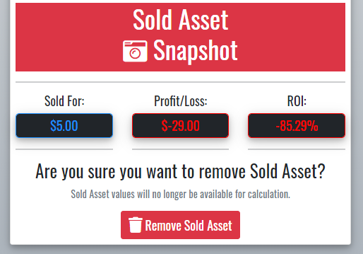
**figure 12**

## Resources

## Developer

Caleb Addie, ASP.NET/C# developer.

